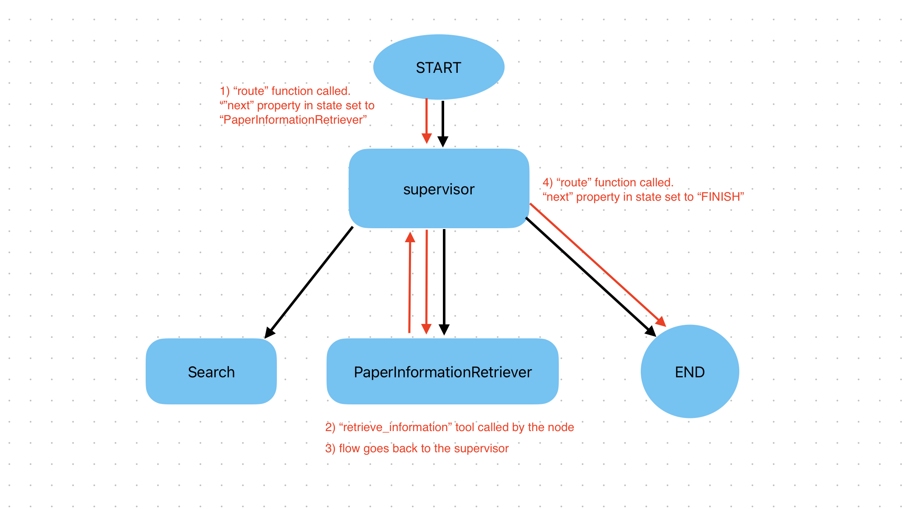

### ❓ Question #1:

Why is a "powerful" LLM important for this use-case?

It's important to use a powerful LLM to try to achieve the best possible reasoning related to research and decision making.

What tasks must our Agent perform that make it such that the LLM's reasoning capability is a potential limiter?

In the case of a supervisor agent, it is expected to correctly and smartly route a specific task to the right agent. Failing to do so would mean wasted time and effort by calling and waiting on the response from a tool that should not have been called in the first place. In the case of a research agent, it's important for the research done to be accurate and coherent.

### 🏗️ Activity #2:

Using whatever drawing application you wish - please label the flow above on a diagram of your graph.

### ❓ Question #2:

How could you make sure your Agent uses specific tools that you wish it to use? Are there any ways to concretely set a flow through tools?

Using the prompt it's possible to specify tool usage policies (e.g. Search the web using Tavily), set a tool flow order (e.g. first, find trending topics in Google Trends, then find news articles related to the trending topics using Tavily), and control reuse and redundancy (e.g. Track the tools you've used. Do not call the same tool twice unless the output is insufficient). However, instructions through the prompt always leave some room for unpredictability.

In order to set a concrete flow through tools, a chain of function agents could be created where each agent has access to only one tool. This would ensure that all tools in the chain are called in the right order. Similarly, a DAG could be defined detailing a specific tool flow.

### 🏗️ Activity #3:

Describe, briefly, what each of these tools is doing in your own words.

- **create_outline**

  This tool takes a list of strings (`points` parameter) and writes them onto a file in an outline format (i.e. as an ordered list)

- **read_document**

  This tool takes a `file_name` parameter that corresponds to a file path. It opens the file with read permission and reads all lines from the file. It will return a single string with the lines specified by the `start` and `end` parameters (or all strings if `start` and `end` are undefined).

- **write_document**

  This tool takes two parameters: `content` and `file_name`, which corresponds to a file path. The tool opens the file at `file_name` and writes the string stored in `content` onto the file.

- **edit_document**

  This tool adds new content to the document located at `file_name`. The tool first reads all lines of the document into a list of strings. Then, each entry in the `inserts` dictionary is added to the list of strings at the position specified by the entry's `key` value. Finally, the document located at `file_name` is overwritten with the new list of strings.
